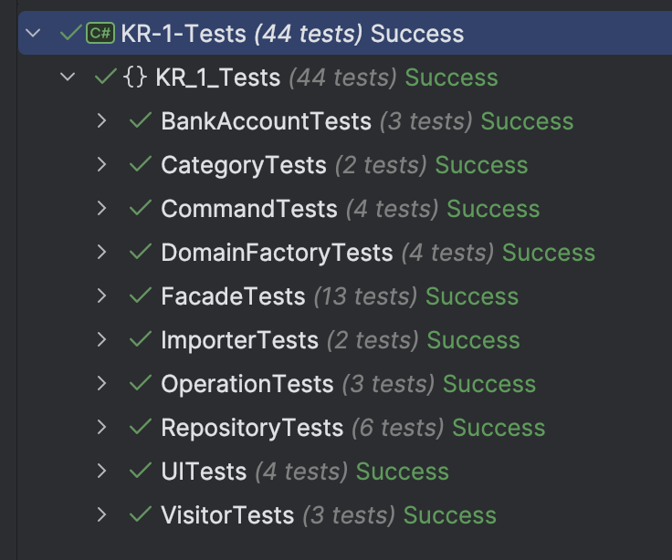
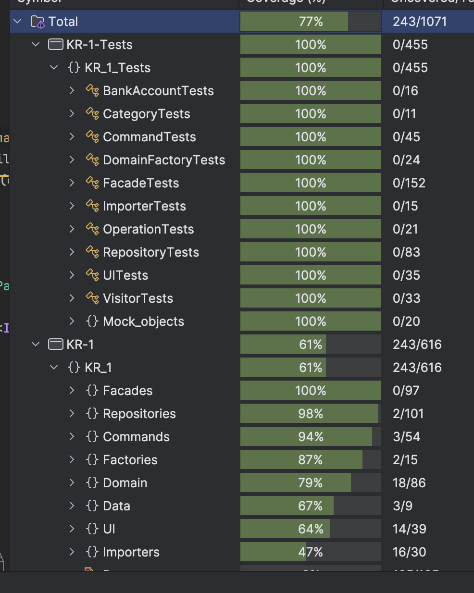

<h1>Отчет по КР-1</h1>

<h2>Инструкция по запуску приложения</h2>
Особых инструкций нет.

<h2>Общая идея решения</h2>

  Консольное приложение, которое позволяет создавать, редактировать и удалять банковские счета, категории и операции (доходы/расходы). Дополнительно реализована аналитика (расчет разницы доходов и расходов, группировка по категориям), импорт/экспорт данных (CSV, YAML, JSON) и пересчет баланса. Функциональные требования не изменялись относительно условий.

<h2>Принципы SOLID и GRASP</h2>
<ul>
  <li><strong>SRP:</strong> Классы <code>BankAccount</code>, <code>Category</code> и <code>Operation</code> отвечают только за хранение данных и базовую бизнес-логику.</li>
  <li><strong>OCP:</strong> Абстрактный класс <code>DataImporter</code> и его наследники расширяются без изменения существующего кода.</li>
  <li><strong>DIP:</strong> Использование DI-контейнера.</li>
  <li><strong>High Cohesion и Low Coupling (GRASP):</strong> Модули <code>Facades</code>, <code>Repositories</code> и <code>Factories</code> организованы таким образом, что каждый из них выполняет строго определенную функцию, минимизируя взаимные зависимости.</li>
</ul>

<h2>Реализованные паттерны GoF</h2>

<h3>Фабрика <code>(Factory)</code></h3>

  Централизует создание объектов, а также валидирует данные. Реализовано в классе <code>DomainFactory</code>:

<pre><code>public static BankAccount CreateBankAccount(string name, decimal initialBalance)
{
    return new BankAccount(Guid.NewGuid(), name, initialBalance);
}</code></pre>

<h3>Фасад <code>(Facade)</code></h3>

  Упрощает работу с подсистемами, объединяет операции CRUD для работы со счетами. Реализовано в классе <code>BankAccountFacade</code>:

<pre><code>public BankAccount CreateBankAccount(string name, decimal initialBalance)
{
    var account = DomainFactory.CreateBankAccount(name, initialBalance);
    _repository.Add(account);
    return account;
}</code></pre>

<h3>Прокси <code>(Proxy)</code></h3>

  Реализует кэширование данных в репозиториях. Реализовано в классе <code>RepositoryProxy&lt;T&gt;</code>:

<pre><code>public class RepositoryProxy&lt;T&gt; : IRepository&lt;T&gt; where T : IEntity
{
    private readonly IRepository&lt;T&gt; _innerRepository;
    private Dictionary&lt;Guid, T&gt; _cache;
    public RepositoryProxy(IRepository&lt;T&gt; innerRepository)
    {
        _innerRepository = innerRepository;
        _cache = _innerRepository.GetAll().ToDictionary(x => x.Id);
    }
}</code></pre>

<h3>Команда и Декоратор <code>(Command + Decorator)</code></h3>

  Инкапсулируют возможные пользовательские сценарии и добавляют функциональность измерения времени. Реализовано в классе <code>TimingCommandDecorator</code>:

<pre><code>public class TimingCommandDecorator : ICommand
{
    private readonly ICommand _innerCommand;
    public TimingCommandDecorator(ICommand innerCommand)
    {
        _innerCommand = innerCommand;
    }
    public void Execute()
    {
        var stopwatch = Stopwatch.StartNew();
        _innerCommand.Execute();
        stopwatch.Stop();
        Console.WriteLine($"Время выполнения команды: {stopwatch.ElapsedMilliseconds} мс");
    }
}</code></pre>

<h3>Шаблонный метод <code>(Template Method)</code></h3>

  Определяет общий алгоритм импорта данных, делегируя конкретные шаги наследникам. Реализовано в классе <code>DataImporter</code> (его наследниках):

<pre><code>public abstract class DataImporter
{
    public void Import(string filePath)
    {
        Console.WriteLine($"Импорт данных из файла по пути: {filePath}");
        string content = File.Exists(filePath) ? File.ReadAllText(filePath) : "";
        var data = ParseData(content);
        SaveData(data);
    }
    protected abstract IEnumerable&lt;IExportable&gt; ParseData(string content);
    protected abstract void SaveData(IEnumerable&lt;IExportable&gt; data);
}</code></pre>

<h3>Посетитель <code>(Visitor)</code></h3>

  Позволяет расширять функциональность объектов без изменения их кода. Реализовано в классе <code>Accept</code>:

<pre><code>public void Accept(IExportVisitor visitor)
{
    visitor.Visit(this);
}</code></pre>

<h3>Тестирование</h3>

  Все тесты успешно выполняются
   
    

  Тестовое покрытие программы 
   
    

